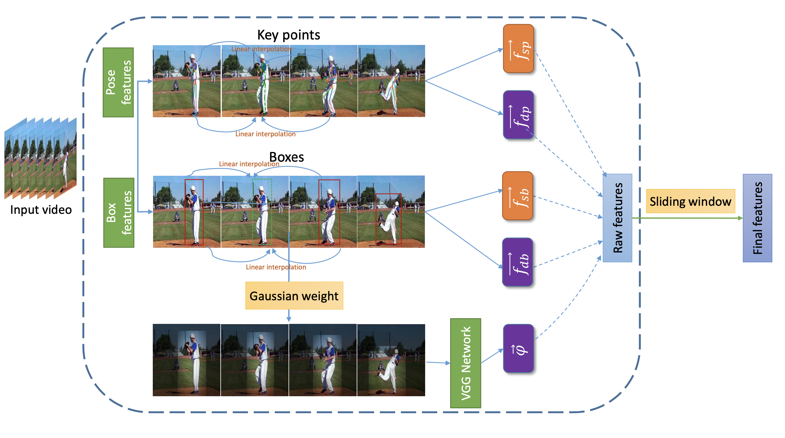

# Video alignment using unsupervised learning of local and global features

 

In this project, you can find the official code for the paper [Video alignment using unsupervised learning of local and global features](https://arxiv.org/abs/2304.06841). 

Table of Contents
=================
  * [Install Dependancy](#install-dependency)
  * [Extracted features for the Penn dataset](#Extracted-features-for-the-Penn-dataset)
  * [Extract features for a given video](#Extract-features-for-a-given-video)
  * [Citation](#Citation)


## Install Dependency
You need to install the packages listed in requirements.txt:
```shell script
pip install -r requirements.txt
```

## Extracted features for the Penn dataset 
You can find our extracted features for the test videos of the Penn action dataset in [extracted features](Penn action test features).
For example the Baseball-pitch.npy file is an array of size of the number of test videos in the Penn action dataset for baseball pitch, and you can load the data using the load function of numpy as follows: 
```shell script
import numpy as np
data = np.load("Baseball-pitch.npy", allow_pickle=True)
```


